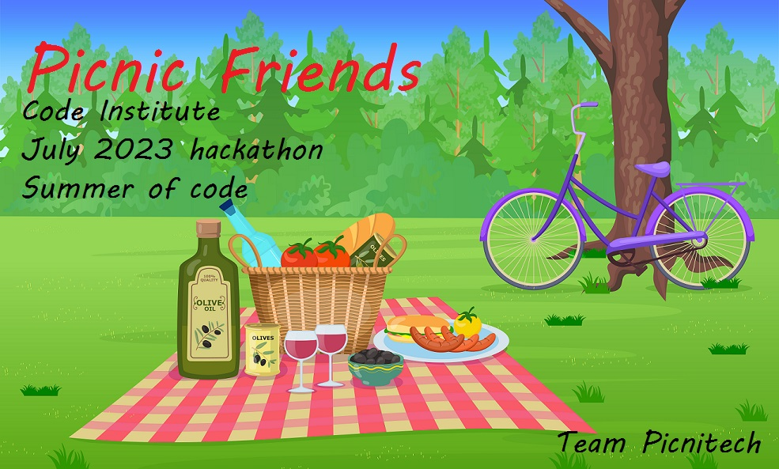
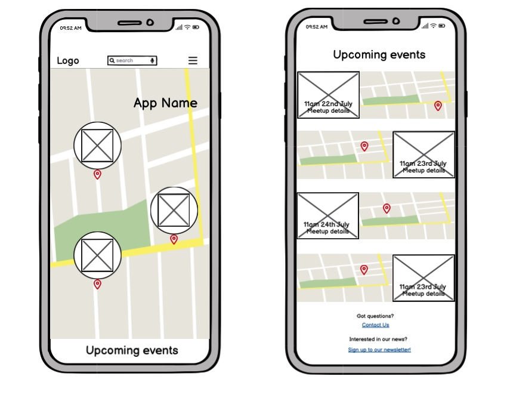
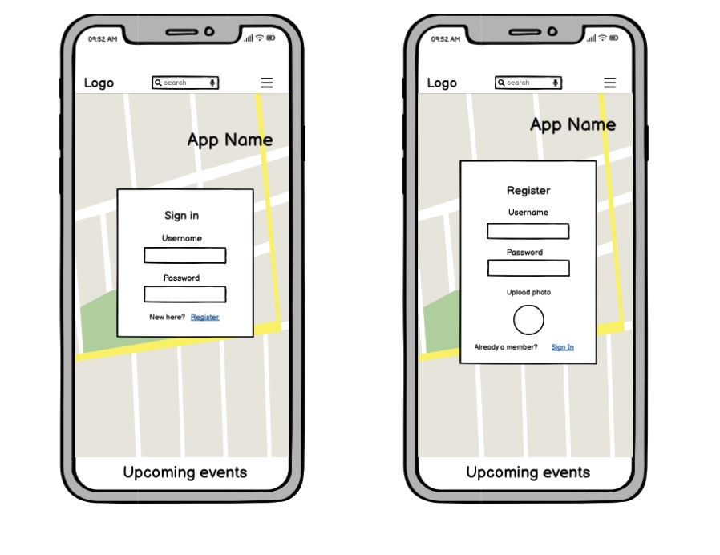
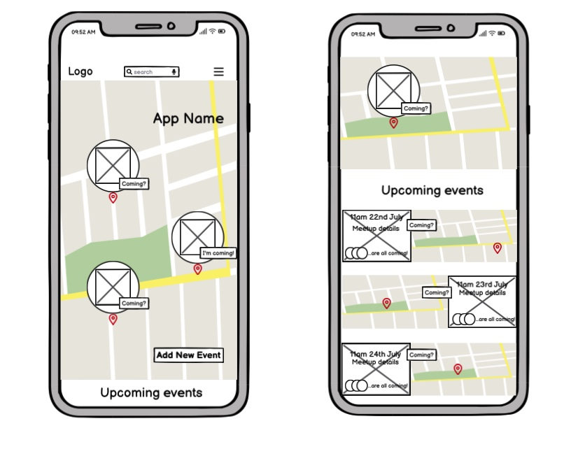
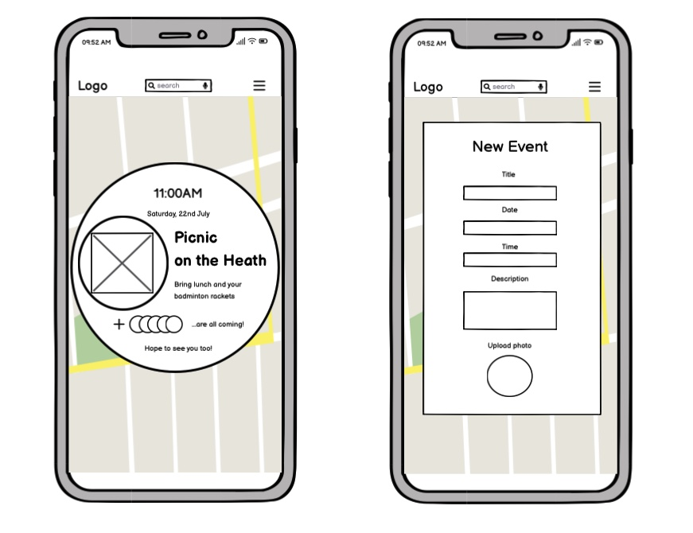

<h1 align="center"><strong>🌞🚵 Summer of Code 🏄🏖️</strong>

</h1>

# SUBMISSION
## Deployment
#### _(please note, your team must also include the deployed links in the usual submission in Hackapp)_
The project is deployed and can be accessed at [https://picnicfriends-b3d57c6873d2.herokuapp.com/](https://picnicfriends-b3d57c6873d2.herokuapp.com/).

## Criteria

For Picnic Friends, we have taken careful consideration of the criteria outlined for the project, ensuring a seamless and user-friendly experience for our app.

By adhering to a mobile-first design, integrating browser location, aligning with the Hackathon Theme and effectively utilizing Github Project Boards and Issues, Picnic Friends fulfills the specified criteria, offering a fun and well-executed solution for the Code Institute July -23 Hackathon.

✨ Project is 100% Mobile First

Picnic Friends has been designed with a mobile-first approach, prioritizing a responsive and intuitive user interface for mobile devices. Our app adapts to various screen sizes, guaranteeing an optimized experience for users on smartphones and tablets. 

✨ Project uses browser location or device camera

To enhance the user experience and facilitate easy navigation, Picnic Friends utilizes browser location services.
This allows users to effortlessly discover nearby picnic events by displaying their current location on the interactive map. 

✨ Project aligns well to the Hackathon Theme

Picnic Friends aligns with the Hackathon Theme of "Summer of Code", by encouraging outdoor activities and socializing, our app embodies the spirit of the summer season!
Picnic Friends promotes a healthy lifestyle and fosters connections among people, while making the most of the beautiful summer weather.

✨ Clear use of Github Projects or other agile tool

In order to streamline development and ensure efficient project management, Picnic Friends employs the use of Github Project Boards and Issues. This allowed our team to create and track user stories, ensuring transparency, collaboration, and efficient project management. It provided a clear overview of tasks and progress, ensuring smooth execution throughout development.

✨ Presentation Quality - Present as if you are pitching it to client

Introducing Picnic Friends, the standalone app that revolutionizes the way people connect and build friendships through the joy of picnics!

Our app is solely dedicated to helping individuals like your users discover and join exciting picnic events in their area. With Picnic Friends, your users can easily organize their own picnics and invite others to join, or explore a dynamic map that showcases ongoing picnics near them. Our app's interactive map even integrates with their device's location services, ensuring they never miss out on a nearby gathering.

With Picnic Friends, you provide your users with a unique and engaging social experience centered around outdoor activities. From tranquil park picnics to adventurous hikes, Picnic Friends empowers individuals to expand their social circles, explore their local community, and create lasting memories with like-minded people.

Don't miss out on the opportunity to connect, socialize, and have a blast with Picnic Friends; together, we'll create a vibrant community where friendships flourish amidst the beauty of the great outdoors.

# ABOUT SUBMISSION
## Intro

Welcome to Picnic Friends, the ultimate app for connecting with new friends while enjoying the great outdoors! Our app is designed to bring people together through the shared experience of picnics. Making new friends as adults can be challenging, which is why we've created a platform that makes it easy to meet like-minded individuals in your local community.

With Picnic Friends, you can create your own picnic events and invite others to join you, or explore the interactive map to discover ongoing picnics near you. The map not only shows you the location of each event but also displays your current position, making it convenient to find picnics happening nearby. Whether you're looking for a relaxing day in the park or an adventurous hike with fellow picnic enthusiasts, Picnic Friends is here to help you connect, socialize and create lasting memories.

Say goodbye to lonely afternoons and hello to new friendships!

## Goal

➡️ Problem Statement

Picnic Friends is a social networking app designed to bring people together through shared outdoor experiences. The app aims to solve the problem of loneliness and lack of social connections by providing a platform where users can organize and join picnic events in their area.

➡️ Objective(s)

 The main objective of Picnic Friends is to facilitate meaningful interactions and help users make new friends while enjoying the outdoors.

➡️ Target Audience

The target audience for this app includes individuals of all ages who are interested in meeting new people, exploring their local community and engaging in outdoor activities.

➡️ Benefits

By using Picnic Friends, users can benefit from the opportunity to expand their social network, discover interesting picnic spots and create lasting memories with like-minded individuals.

## Wireframes

## Tech

### Languages
- HTML5
- CSS
- Python
- Javascript

### Frameworks
- Bootstrap
- Django

### Other software, libraries and dependencies
- Allauth
- Git
- Github
- Heroku

## Credits
- Logo from [SeekPNG](https://www.seekpng.com/ipng/u2q8y3y3q8u2w7y3_logo-picnic-basket/)
- Favicon generated from [Favicon.io](https://favicon.io/)
- [Leaflet JS Maps](https://leafletjs.com/)
- Wireframes created in [Balsamiq](https://balsamiq.com/)
- [Picnic marker image](https://unsplash.com/photos/it-VGwoQ6XQ)
- Banner from [Freepik](https://www.freepik.com/free-photos-vectors/picnic-scene)
