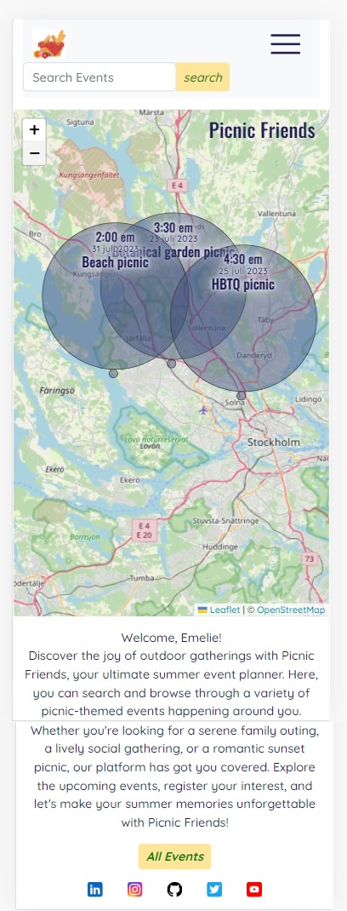
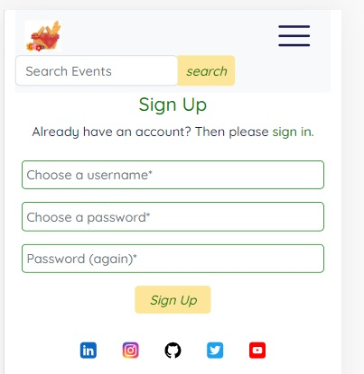
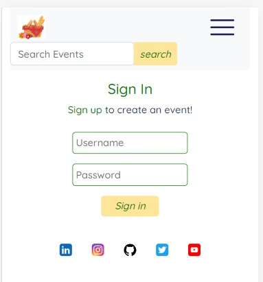
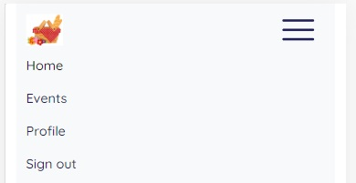
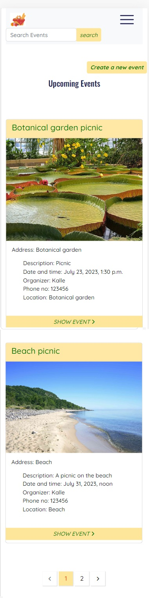
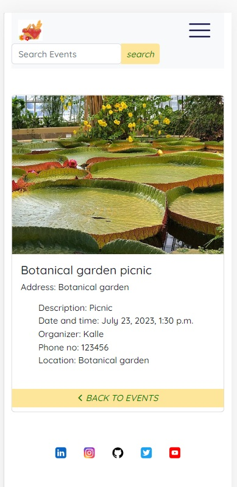
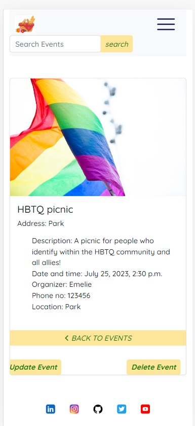
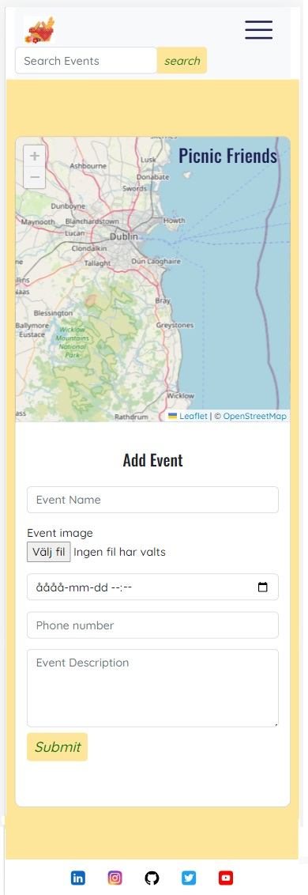
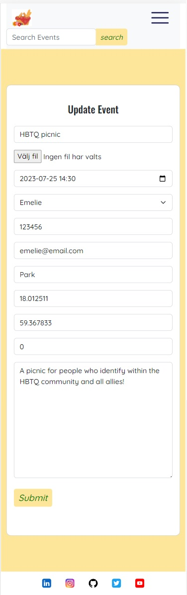
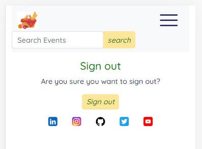

<h1 align="center"><strong>🌞🚵 Summer of Code 🏄🏖️</strong>

</h1>

# SUBMISSION
## Deployment
#### _(please note, your team must also include the deployed links in the usual submission in Hackapp)_
The project is deployed and can be accessed at [https://picnicfriends-b3d57c6873d2.herokuapp.com/](https://picnicfriends-b3d57c6873d2.herokuapp.com/).

## Criteria

For Picnic Friends, we have taken careful consideration of the criteria outlined for the project, ensuring a seamless and user-friendly experience for our app.

By adhering to a mobile-first design, integrating browser location, aligning with the Hackathon Theme and effectively utilizing Github Project Boards and Issues, Picnic Friends fulfills the specified criteria, offering a fun and well-executed solution for the Code Institute July -23 Hackathon.

✨ Project is 100% Mobile First

Picnic Friends has been designed with a mobile-first approach, prioritizing a responsive and intuitive user interface for mobile devices. Our app adapts to various screen sizes, guaranteeing an optimized experience for users on smartphones and tablets. 

✨ Project uses browser location or device camera

To enhance the user experience and facilitate easy navigation, Picnic Friends utilizes browser location services.
This allows users to effortlessly discover nearby picnic events by displaying their current location on the interactive map. 

✨ Project aligns well to the Hackathon Theme

Picnic Friends aligns with the Hackathon Theme of "Summer of Code", by encouraging outdoor activities and socializing, our app embodies the spirit of the summer season!
Picnic Friends promotes a healthy lifestyle and fosters connections among people, while making the most of the beautiful summer weather.

✨ Clear use of Github Projects or other agile tool

In order to streamline development and ensure efficient project management, Picnic Friends employs the use of Github Project Boards and Issues. This allowed our team to create and track user stories, ensuring transparency, collaboration, and efficient project management. It provided a clear overview of tasks and progress, ensuring smooth execution throughout development.

✨ Presentation Quality - Present as if you are pitching it to client

## Intro

Welcome to Picnic Friends, the ultimate app for connecting with new friends while enjoying the great outdoors! Our app is designed to bring people together through the shared experience of picnics. Making new friends as adults can be challenging, which is why we've created a platform that makes it easy to meet like-minded individuals in your local community.

With Picnic Friends, you can create your own picnic events and invite others to join you, or explore the interactive map to discover ongoing picnics near you. The map not only shows you the location of each event but also displays your current position, making it convenient to find picnics happening nearby. Whether you're looking for a relaxing day in the park or an adventurous hike with fellow picnic enthusiasts, Picnic Friends is here to help you connect, socialize and create lasting memories.

Say goodbye to lonely afternoons and hello to new friendships!

## Picnic Friends features

Landing page

Sign up page

Sign in page

Navbar

All events page

Detailed events page

Edit and delete button for author

Form for posting event

Edit event form

User bio

Sign out message

## Goal

➡️ Problem Statement

Picnic Friends is a social networking app designed to bring people together through shared outdoor experiences. The app aims to solve the problem of loneliness and lack of social connections by providing a platform where users can organize and join picnic events in their area.

➡️ Objective(s)

 The main objective of Picnic Friends is to facilitate meaningful interactions and help users make new friends while enjoying the outdoors.

➡️ Target Audience

The target audience for this app includes individuals of all ages who are interested in meeting new people, exploring their local community and engaging in outdoor activities.

➡️ Benefits

By using Picnic Friends, users can benefit from the opportunity to expand their social network, discover interesting picnic spots and create lasting memories with like-minded individuals.

## The Picnitech team

### [Szilvia Csernusne Berczes](https://github.com/szilvia-csernus)

### [Mohamed Ayman](https://github.com/moabdelbasset)

### [AbiDinu]()

### [Emelie Markkanen Åberg](https://github.com/EmelieMarkkanen)

## Wireframes

## Tech

### Languages
- HTML5
- CSS
- Python
- Javascript

### Frameworks
- Bootstrap
- Django

### Other software, libraries and dependencies
- Allauth
- Git
- Github
- Heroku

## Bugs

### Fixed

### Not fixed

## Deployment

### Github & Gitpod

We created a repository in Github, named it ´picnicfriends´, and used the template Code-Institute-Org/gitpod-full-template

- Once the repository is created, click the green button to the right (Gitpod) to open a new Gitpod workspace. 
- To open and work on the project it is best to open the workspace from Gitpod workspaces (rather than Github), this will open your previous workspace rather than creating a new one. You should pin the workspace. 
- Committing changes should be donSe often and should have clear messages. Use the following commands to make your commits:
    - `git add .`: adds all modified files to a staging area
    - `git commit -m "A message explaining your commit"`: commits all changes to a local repository.
    - `git push`: pushes all your committed changes to your Github repository.
- While working on the project I used the Gitpod development server to view the website in action. To start the development server run the following command: `Python3 manage.py runserver`. 

### Create a Django project and app

- Install Django and supporting libraries. I've used Gunicorn, Cloudinary and psycopg2 to start. 
- In the terminal of the Gitpod workspace type django-admin startproject 'project_name' - project_name is desired project name
- In the terminal of the Gitpod workspace type python3 manage.py startapp 'app_name' - app_name is desired app name 
- Create a Requirements.txt file (type pip3 freeze --local > requirements.txt), a env.py file and Procfile on the top level of the project directory. 
- In settings.py add the installed apps names into the installed apps array variable and save the file.
- Move the SECRET KEY to the env.py file, and add the DATABASE URL and CLOUDINARY URL as well. 
- Migrate changes by using the command python3 manage.py migrate.

### ElephantSQL

- Log into ElephantSQL or create new account.
- Click to create new instance and set up the plan by giving it a name, I selected the tiny turtle plan. 
- Select a region (data center) closest to your location. 
- Click review, check that all the details are correct and then click create instance. 
- Return to the ElephantSQL dashboard and click on the database instance name for the project.
- Copy the ElephantSQL database URL that begin with 'postgres://' using the copy icon. 

### Heroku

We followed the steps in the Code Institute course material and [Django Blog cheatsheet](https://codeinstitute.s3.amazonaws.com/fst/Django%20Blog%20Cheat%20Sheet%20v1.pdf)

- Log into Heroku or create an account.
- Click ´New´ create new heroku app. Give the app an app name and select your region, I chose Europe. 
- Open the app settings tab and click ´Reveal config vars´
- Add a config var called ´DATABASE_URL´ and paste in the ElephantSQL database URL
- Add the config var ´SECRET KEY´ with the secret key from the Django app settings.py file. It is recommended to create a new secret key for safety purposes. 
- Add the config vars ´CLOUDINARY_URL´, ´DATABASE_URL´, ´PORT´ and ´DISABLE_COLLECTSTATIC´. 
- Under the project deploy tab, select GitHub for the deployment method. Search for the repository name and click connect. Scroll down to the manual deployment section and click deploy branch. Make sure you have the main branch selected. 

## Credits
- Logo from [SeekPNG](https://www.seekpng.com/ipng/u2q8y3y3q8u2w7y3_logo-picnic-basket/)
- Favicon generated from [Favicon.io](https://favicon.io/)
- [Leaflet JS Maps](https://leafletjs.com/)
- Wireframes created in [Balsamiq](https://balsamiq.com/)
- [Picnic marker image](https://unsplash.com/photos/it-VGwoQ6XQ)
- Banner from [Freepik](https://www.freepik.com/free-photos-vectors/picnic-scene)
